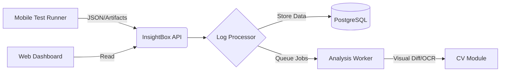

# 📦 InsightBox

**InsightBox** es el núcleo de observabilidad y análisis para el ecosistema de **Mobile-UI-Automation**. Diseñado para ingerir, procesar y visualizar los resultados de pruebas automatizadas en dispositivos móviles, transformando logs crudos y capturas de pantalla en *insights* accionables para los equipos de desarrollo y QA.

## 🚀 Resumen del Proyecto

En el desarrollo de aplicaciones móviles modernas, la automatización genera gigabytes de datos (logs de Appium/Maestro, capturas de pantalla, videos de sesiones y trazas de red). **InsightBox** resuelve el problema de la "fatiga de logs" centralizando estos artefactos.

El sistema actúa como una "caja negra" inteligente que recibe el output de las ejecuciones de CI/CD y utiliza algoritmos de procesamiento (y opcionalmente modelos de ML) para categorizar fallos, detectar regresiones visuales y métricas de rendimiento.

### 🎯 Objetivos Principales

  * **Centralización:** Un único punto de verdad para el estado de calidad de las aplicaciones móviles.
  * **Análisis Visual:** Comparación de screenshots para detectar cambios no deseados en la UI (Visual Regression Testing).
  * **Clasificación de Errores:** Agrupación automática de trazas de error similares para facilitar el triage.
  * **Histórico de Rendimiento:** Seguimiento de tiempos de carga y respuesta de la UI a lo largo del tiempo.

-----

## ✨ Características Clave

  * **Dashboard Interactivo:** Interfaz web moderna (construida con **Vue 3/Nuxt**) para navegar por las sesiones de prueba.
  * **Docker-First:** Despliegue sencillo mediante `docker-compose` para integración rápida en pipelines locales o en la nube.
  * **Alertas:** Integración con Slack/Discord para notificaciones de "Build Failed".

-----

## 🛠️ Stack Tecnológico

La arquitectura de InsightBox está diseñada para ser modular y escalable:

  * **Backend:** Python (FastAPI) / Go (para procesamiento concurrente de logs).
  * **Frontend:** Vue 3 + TailwindCSS (visualización de datos).
  * **Base de Datos:** PostgreSQL (persistencia de sesiones) + Redis (caché y colas).
  - **Message Broker:** Apache Kafka
  * **Infraestructura:** Docker & Docker Compose.
  * **Observabilidad:** Integración lista para Prometheus/Grafana.

-----

## 📸 Arquitectura

[Image of mobile test automation architecture diagram]

-----

